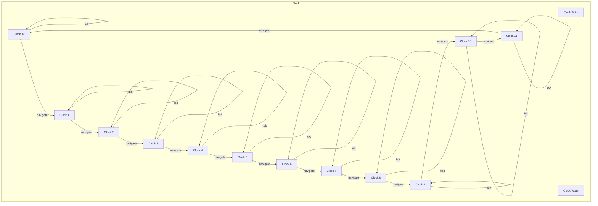

```mermaid
flowchart TD;
subgraph "Clock"
Clock.Ticks;
Clock.Value;
Clock.1;
Clock.2;
Clock.3;
Clock.4;
Clock.5;
Clock.6;
Clock.7;
Clock.8;
Clock.9;
Clock.10;
Clock.11;
Clock.12;
end
Clock.12-->|tick|Clock.12;
Clock.12-->|navigate|Clock.1;
Clock.11-->|tick|Clock.11;
Clock.11-->|navigate|Clock.12;
Clock.10-->|tick|Clock.10;
Clock.10-->|navigate|Clock.11;
Clock.9-->|tick|Clock.9;
Clock.9-->|navigate|Clock.10;
Clock.8-->|tick|Clock.8;
Clock.8-->|navigate|Clock.9;
Clock.7-->|tick|Clock.7;
Clock.7-->|navigate|Clock.8;
Clock.6-->|tick|Clock.6;
Clock.6-->|navigate|Clock.7;
Clock.5-->|tick|Clock.5;
Clock.5-->|navigate|Clock.6;
Clock.4-->|tick|Clock.4;
Clock.4-->|navigate|Clock.5;
Clock.3-->|tick|Clock.3;
Clock.3-->|navigate|Clock.4;
Clock.2-->|tick|Clock.2;
Clock.2-->|navigate|Clock.3;
Clock.1-->|tick|Clock.1;
Clock.1-->|navigate|Clock.2;
```
