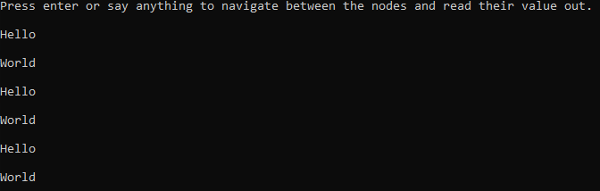

<!-- PROJECT SHIELDS -->
<!--
*** I'm using markdown "reference style" links for readability.
*** Reference links are enclosed in brackets [ ] instead of parentheses ( ).
*** See the bottom of this document for the declaration of the reference variables
*** for contributors-url, forks-url, etc. This is an optional, concise syntax you may use.
*** https://www.markdownguide.org/basic-syntax/#reference-style-links
-->
[![Contributors][contributors-shield]][contributors-url]
[![Forks][forks-shield]][forks-url]
[![Stargazers][stars-shield]][stars-url]
[![Issues][issues-shield]][issues-url]
[![MIT License][license-shield]][license-url]


<!-- PROJECT LOGO -->
<br />
<p align="center">
  <a href="https://github.com/goldenwitch/action-graphs">
    
  </a>

  <h3 align="center">Action-Graphs</h3>

  <p align="center">
    Model the world in composable graphs to rapidly create conversational experiences, state machines, and asynchronous workflows (or whatever else you can dream up!)
    <br />
    <a href="https://github.com/goldenwitch/action-graphs"><strong>Explore the docs »</strong></a>
    <br />
    <br />
    <a href="https://github.com/goldenwitch/action-graphs">View Demo</a>
    ·
    <a href="https://github.com/goldenwitch/action-graphs/issues">Report Bug</a>
    ·
    <a href="https://github.com/goldenwitch/action-graphs/issues">Request Feature</a>
  </p>
</p>


<!-- TABLE OF CONTENTS -->
<details open="open">
  <summary><h2 style="display: inline-block">Table of Contents</h2></summary>
  <ol>
    <li>
      <a href="#about-the-project">About The Project</a>
    </li>
    <li>
      <a href="#getting-started">Getting Started</a>
      <ul>
        <li><a href="#prerequisites">Prerequisites</a></li>
        <li><a href="#installation">Installation</a></li>
      </ul>
    </li>
    <li><a href="#usage">Usage</a></li>
    <li><a href="#roadmap">Roadmap</a></li>
    <li><a href="#contributing">Contributing</a></li>
    <li><a href="#license">License</a></li>
    <li><a href="#contact">Contact</a></li>
    <li><a href="#acknowledgements">Acknowledgements</a></li>
  </ol>
</details>


<!-- ABOUT THE PROJECT -->
## About The Project

[![Product Name Screen Shot][product-screenshot]](https://example.com)

We offer a library for defining and operating over mixed type, composable graphs. Most graph definitions treat graphs as a pure data model, sticking to scholastic definitions where the graphs contain the same kinds of values and the most complicated edges are simply weights.

Action-Graphs takes this starting point and adds the ability to define not only which nodes are related in the graph, but also the ability to describe each connection as an independant action that a graph "walker" executes.

<!-- GETTING STARTED -->
## Getting Started

To get a local copy up and running follow these simple steps.

### Prerequisites

The library is built on .net core 3.1 and written in F#.
* <a href="https://dotnet.microsoft.com/download"><strong>.Net Core 3.1</strong></a>

### Installation

1. Clone the repo
   ```sh
   git clone https://github.com/goldenwitch/action-graphs.git
   ```
2. Open and build the .sln

<!-- USAGE EXAMPLES -->
## F# Quickstart

Write hello world in graphs in three simple steps!

### First...
Create a new F# console app. 
<a href="https://docs.microsoft.com/en-us/dotnet/fsharp/get-started/get-started-visual-studio"><strong>F# Getting Started Guide</strong></a>

Add a reference to the Action-Graphs library.

### Secondly...
Define your graph in json.
```json
{
  //Your top level graph definition
  "Nodes": [
    {
      "Id": "Start", //Each node has an addressable id that is unique to the graph that defines it (in this case the top level definition)
      "Edges": [
        {
          "Id": "text", //Each edge also has a uniquely addressable id that is unique to the node it is on
          "Action": "console.text", //This action references a passed in function that should run when this edge is walked. This one is from the prebuilt console actions and just emits the value of the node to console.
          "To": "[End]" //A "contextual node selector" describing a relationship between this node and a destination
        }
      ],
      "Value": "Hello"
    },
    {
      "Id": "End",
      "Edges": [
        {
          "Id": "text",
          "Action": "console.text",
          "To": "[Start]"
        }
      ],
      "Value": "World"
    }
  ]
}
```

Save this as helloWorld.json in your project, or remember what you saved it for the next step.

### Finally...

The last step is to import the graph, and pump the console input into it via a "walker".

```fsharp
open System
open ActionGraph
open ActionGraph.Expressions
open System.IO

//Our core loop that runs every time we send a console message.
let consoleLoop (graph, walker:Walker) =
    walker.Walk(graph, "text") //Walk our graph, following the "text" edge each time
    ()

let rec result(graph, walker) =
    Console.ReadLine() |> ignore //Ignore what the user says for this sample
    consoleLoop(graph, walker) //Run our console loop
    result(graph, walker)

[<EntryPoint>]
let main argv =
    Console.WriteLine("Press enter or say anything to navigate between the nodes and read their value out.")
    let edgeFunctions = Map.ofSeq(Prebuilts.ConsoleEdges) //These prebuilt edges include ways to output to console.
    let graphDefinition = ActionGraph.Load(File.ReadAllText("helloWorld.json"), edgeFunctions) //Load our JSON as a graph, and enable the specific edge functions
    match graphDefinition with //Here we are handling the case in which we don't succeed at loading our graph
    | Some g ->
        let playerWalker = //Create a "walker" which points to a specific place in the graph and follows the edges between nodes.
            {
                CurrentNode = g.Nodes.[StringValue "Start"]
            }
        result(g, playerWalker) //Start the console loop, passing in the walker to go walk the graph
    | None -> ()

    0 // return an integer exit code
```



_For more examples, please refer to the [Documentation](https://example.com)_


<!-- ROADMAP -->
## Roadmap

See the [open issues](https://github.com/goldenwitch/action-graphs/issues) for a list of proposed features (and known issues).


<!-- CONTRIBUTING -->
## Contributing

Contributions are what make the open source community such an amazing place to be learn, inspire, and create. Any contributions you make are **greatly appreciated**.

1. Fork the Project
2. Create your Feature Branch (`git checkout -b feature/AmazingFeature`)
3. Commit your Changes (`git commit -m 'Add some AmazingFeature'`)
4. Push to the Branch (`git push origin feature/AmazingFeature`)
5. Open a Pull Request


<!-- LICENSE -->
## License

Distributed under the MIT License. See `LICENSE` for more information.


<!-- CONTACT -->
## Contact

Please open github issues if you run into any grief.

Project Link: [https://github.com/goldenwitch/action-graphs](https://github.com/goldenwitch/action-graphs)


<!-- MARKDOWN LINKS & IMAGES -->
<!-- https://www.markdownguide.org/basic-syntax/#reference-style-links -->
[contributors-shield]: https://img.shields.io/github/contributors/goldenwitch/repo.svg?style=for-the-badge
[contributors-url]: https://github.com/goldenwitch/action-graphs/graphs/contributors
[forks-shield]: https://img.shields.io/github/forks/goldenwitch/repo.svg?style=for-the-badge
[forks-url]: https://github.com/goldenwitch/action-graphs/network/members
[stars-shield]: https://img.shields.io/github/stars/goldenwitch/repo.svg?style=for-the-badge
[stars-url]: https://github.com/goldenwitch/action-graphs/stargazers
[issues-shield]: https://img.shields.io/github/issues/goldenwitch/repo.svg?style=for-the-badge
[issues-url]: https://github.com/goldenwitch/action-graphs/issues
[license-shield]: https://img.shields.io/github/license/goldenwitch/repo.svg?style=for-the-badge
[license-url]: https://github.com/goldenwitch/action-graphs/blob/main/LICENSE.txt
[linkedin-shield]: https://img.shields.io/badge/-LinkedIn-black.svg?style=for-the-badge&logo=linkedin&colorB=555
[linkedin-url]: https://linkedin.com/in/goldenwitch
