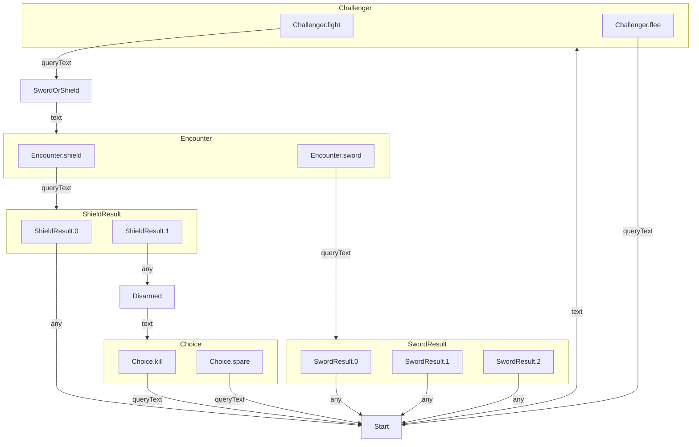

```mermaid
flowchart TD;
subgraph "Challenger"
Challenger.fight;
Challenger.flee;
end
subgraph "Choice"
Choice.kill;
Choice.spare;
end
Disarmed;
subgraph "Encounter"
Encounter.shield;
Encounter.sword;
end
subgraph "ShieldResult"
ShieldResult.0;
ShieldResult.1;
end
Start;
SwordOrShield;
subgraph "SwordResult"
SwordResult.0;
SwordResult.1;
SwordResult.2;
end
SwordResult.2-->|any|Start;
SwordResult.1-->|any|Start;
SwordResult.0-->|any|Start;
SwordOrShield-->|text|Encounter;
Start-->|text|Challenger;
ShieldResult.1-->|any|Disarmed;
ShieldResult.0-->|any|Start;
Encounter.sword-->|queryText|SwordResult;
Encounter.shield-->|queryText|ShieldResult;
Disarmed-->|text|Choice;
Choice.spare-->|queryText|Start;
Choice.kill-->|queryText|Start;
Challenger.flee-->|queryText|Start;
Challenger.fight-->|queryText|SwordOrShield;
```
